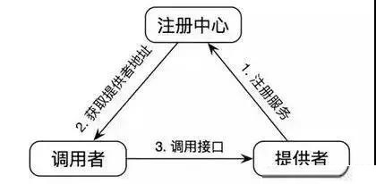
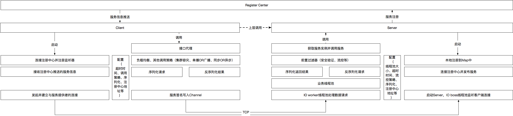

# 入门

## RPC简介

RPC（Remote Procedure Call）— 远程过程调用，是一个计算机通信协议。该协议允许运行于一台计算机的程序调用另一台计算机的子程序，而程序员无需额外地为这个交互作用编程。





## RPC实现

+ 基本功能、简单的RPC，需要实现以下功能：
  + 动态代理，为客户端生成实现类，远程调用。
  + 序列化，反序列化，用于传输对象。
  + 服务发现和注册。
  + 心跳与链路检测
  + ...

# 解决tcp粘包拆包

+ 由于我们使用的是自定义协议，所以解决粘包拆包使用`LengthFieldBasedFrameDecoder`。

+ ```java
  @Override
  protected void initChannel(SocketChannel ch) throws Exception {
      ChannelPipeline pipeline = ch.pipeline();
      pipeline.addLast(new LengthFieldBasedFrameDecoder(MAX_FRAME_LENGTH, RpcConstant.MAGIC_NUMBER.length + 2, 4))
          .addLast(new RpcDecoder(new JdKSerializer()))
          .addLast(new RpcEncoder(new JdKSerializer()));
  }
  ```

+ 测试可以通过指定`Bootstrap`的`option`调小接收窗口来测试

+ ```java
  b.option(ChannelOption.SO_RCVBUF,10);
  ```

# 实现接口代理

+ 对于客户端，RPC需要为接口生成代理类，以支持RPC，但是对于接口无法通过`BeanPostProcessor`来进行AOP代理，因为接口无法被注册成Bean，所以这里需要类似Mybatis的`@Mapper`注解类似的操作。

+ 这里我们通过Spring提供的接口`BeanDefinitionRegistryPostProcessor`来实现相应的功能。

```java
package cn.gloduck.netty.rpc.scan;

import cn.gloduck.netty.rpc.annotation.RpcClient;
import cn.hutool.core.util.ClassUtil;
import org.slf4j.Logger;
import org.slf4j.LoggerFactory;
import org.springframework.beans.BeansException;
import org.springframework.beans.factory.config.ConfigurableListableBeanFactory;
import org.springframework.beans.factory.support.BeanDefinitionBuilder;
import org.springframework.beans.factory.support.BeanDefinitionRegistry;
import org.springframework.beans.factory.support.BeanDefinitionRegistryPostProcessor;
import org.springframework.beans.factory.support.GenericBeanDefinition;
import org.springframework.stereotype.Component;

import java.util.Set;

/**
 * https://blog.csdn.net/lichuangcsdn/article/details/89694363
 * 此处可以扫描带有RpcClient注解的类，然后通过工厂模式创建一个代理，并且注册到Bean容器中。
 */
@Component
public class RpcProxyBeanDefinitionRegistryPostProcessor implements  BeanDefinitionRegistryPostProcessor {
    private static final Logger logger = LoggerFactory.getLogger(RpcProxyBeanDefinitionRegistryPostProcessor.class);


    @Override
    public void postProcessBeanFactory(ConfigurableListableBeanFactory beanFactory) throws BeansException {
    }

    /**
     * 扫描bean并为带有RpcClient注解的接口创建实现类，然后注入到容器
     * @param registry
     * @throws BeansException
     */
    @Override
    public void postProcessBeanDefinitionRegistry(BeanDefinitionRegistry registry) throws BeansException {
        Set<Class<?>> classes = ClassUtil.scanPackage();
        for (Class<?> beanClass : classes) {
            RpcClient annotation = beanClass.getAnnotation(RpcClient.class);
            if(annotation != null){
                BeanDefinitionBuilder builder = BeanDefinitionBuilder.genericBeanDefinition(beanClass);
                GenericBeanDefinition definition = (GenericBeanDefinition) builder.getRawBeanDefinition();
                //在这里，我们可以给该对象的属性注入对应的实例。
                //比如mybatis，就在这里注入了dataSource和sqlSessionFactory，
                // 注意，如果采用definition.getPropertyValues()方式的话，
                // 类似definition.getPropertyValues().add("interfaceType", beanClazz);
                // 则要求在FactoryBean（本应用中即ServiceFactory）提供setter方法，否则会注入失败
                // 如果采用definition.getConstructorArgumentValues()，
                // 则FactoryBean中需要提供包含该属性的构造方法，否则会注入失败
                definition.getConstructorArgumentValues().addGenericArgumentValue(beanClass);

                //注意，这里的BeanClass是生成Bean实例的工厂，不是Bean本身。
                // FactoryBean是一种特殊的Bean，其返回的对象不是指定类的一个实例，
                // 其返回的是该工厂Bean的getObject方法所返回的对象。
                definition.setBeanClass(RpcServiceFactory.class);

                //这里采用的是byType方式注入，类似的还有byName等
                definition.setAutowireMode(GenericBeanDefinition.AUTOWIRE_BY_TYPE);
                registry.registerBeanDefinition(beanClass.getSimpleName(), definition);

            }
        }

    }
}

```

+ 工厂模式，用于对接口创建代理。返回的类将会被上面的`RpcProxyBeanDefinitionRegistryPostProcessor`注册到Spring容器中。

```java
package cn.gloduck.netty.rpc.scan;

import cn.gloduck.netty.rpc.proxy.RpcProxy;
import org.springframework.beans.factory.FactoryBean;

import java.lang.reflect.Proxy;

/**
 * 自定义的FactoryBean，使用工厂模式为带有RpcClient的类创建实现类。
 * @param <T>
 */
public class RpcServiceFactory<T> implements FactoryBean<T> {
    private Class<T> interfaceType;

    public RpcServiceFactory(Class<T> interfaceType) {
        this.interfaceType = interfaceType;
    }


    @Override
    public T getObject() throws Exception {
        return (T)Proxy.newProxyInstance(interfaceType.getClassLoader(), new Class<?>[]{interfaceType}, new RpcProxy());
    }

    @Override
    public Class<?> getObjectType() {
        return interfaceType;
    }
}

```

# Netty关闭，服务下线；Netty启动，服务上线

+ 为了方便解耦，我们使用观察者模式。

+ 首先定义一个监听器接口。

+ ```java
  package cn.gloduck.netty.rpc.listener;
  
  import cn.gloduck.netty.rpc.transport.NettyConfig;
  
  /**
   * netty状态改变的监听器
   * @author Gloduck
   */
  public interface NettyStateListener {
      /**
       * Netty启动事件
       * @param config
       */
      void onNettyStart(NettyConfig config);
  
      /**
       * Netty停止事件
       * @param config
       */
      void onNettyStop(NettyConfig config);
  
      /**
       * Netty启动出错事件
       * @param e
       */
      void onException(Throwable e);
  }
  
  ```

+ 然后在Netty的各个流程发布各种事件。位于：`AbstractNettyServer`

  + Netty启动：

    + ```java
      @Override
      public final void start() {
          boolean flag = false;
          try {
              this.initNettyServer();
              flag = true;
          } catch (Exception e) {
              logger.warn("Netty启动失败 , {}", e.getMessage());
              if(!CollectionUtil.isEmptyCollection(listeners)){
                  // 发布启动失败时间
                  for (NettyStateListener listener : listeners) {
                      listener.onException(e);
                  }
              }
          }
          if(flag){
              if(!CollectionUtil.isEmptyCollection(listeners)){
                  for (NettyStateListener listener : listeners) {
                      // 发布Netty启动事件
                      listener.onNettyStart(nettyConfig);
                  }
              }
          }
      }
      ```

  + Netty关闭：

    + ```java
      @Override
      public final void stop() {
          this.destroyNettyServer();
          if(!CollectionUtil.isEmptyCollection(listeners)){
              for (NettyStateListener listener : listeners) {
                  // 发布Netty关闭事件
                  listener.onNettyStop(nettyConfig);
              }
          }
      }
      ```

  + 添加监听器事件：

    + ```java
      /**
           * 添加Netty的监听器
           * @param listener
           */
      public void addListener(NettyStateListener listener){
          if(this.listeners == null){
              this.listeners = new LinkedList<>();
          }
          this.listeners.add(listener);
      }
      ```

+ 创建一个注册中心对于Netty的监听器

+ ```java
  package cn.gloduck.netty.rpc.listener.impl;
  
  import cn.gloduck.netty.rpc.listener.NettyStateListener;
  import cn.gloduck.netty.rpc.registry.Registry;
  import cn.gloduck.netty.rpc.transport.NettyConfig;
  
  /**
   * @author Gloduck
   */
  public class NettyRegistryListener implements NettyStateListener {
      private Registry registry;
  
      public NettyRegistryListener(Registry registry) {
          this.registry = registry;
      }
  
      @Override
      public void onNettyStart(NettyConfig config) {
          // 在netty启动时，同时上线所有注册过的服务
          registry.registry();
      }
  
      @Override
      public void onNettyStop(NettyConfig config) {
          // 在netty关闭时，下线所有已经注册的服务
          registry.unRegistry();
      }
  
      @Override
      public void onException(Throwable e) {
  
      }
  }
  
  ```

+ 最后在引导中将监听器注册上去就行了。

# 心跳检测

+ 由于服务端需要感知客户端是否还在线，如果不在线就关闭连接。客户端也需要检测服务端是否还在线，如果不在线就关闭连接。

+ 为了实现心跳，我们需要在pipline中添加一个`IdleStateHandler`，它能帮我们处理连接空闲。

  + 读空闲
  + 写空闲
  + 读写空闲

+ 对于服务端，我们检测心跳`RpcBeat`

  ```java
  package cn.gloduck.netty.rpc.codec;
  
  import cn.gloduck.netty.rpc.enums.MessageType;
  
  /**
   * rpc心跳包
   * @author Gloduck
   */
  public final class RpcBeat implements RpcMessage {
      private RpcBeat(){}
      private static final RpcBeat instance = new RpcBeat();
      public static RpcBeat instance(){
          return instance;
      }
      @Override
      public MessageType getMessageType() {
          return MessageType.RPC_BEAT;
      }
  }
  
  ```

+ 创建一个专门的Handler来接收心跳包，并且在里面设置一个计数器，收到心跳后就重置计数器。否则在`userEventTriggered`中就会调用`ctx.disconnect();`关闭连接。（注意，此处我是把心跳区分开了的，客户端必须发送心跳，RPC请求并不作为检测心跳的条件，即如果客户端没有发送心跳包的话，即使在请求也会关闭连接）。代码位于：`RpcServerHeartBeatHandler`

  ```java
  package cn.gloduck.netty.rpc.transport.server;
  
  import cn.gloduck.netty.rpc.codec.RpcBeat;
  import io.netty.channel.ChannelHandlerContext;
  import io.netty.channel.SimpleChannelInboundHandler;
  import io.netty.handler.timeout.IdleStateEvent;
  import org.slf4j.Logger;
  import org.slf4j.LoggerFactory;
  
  /**
   * 服务端心跳处理器
   * @author Gloduck
   */
  public class RpcServerHeartBeatHandler extends SimpleChannelInboundHandler<RpcBeat> {
      private static final Logger logger = LoggerFactory.getLogger(RpcServerHeartBeatHandler.class);
      private int counter;
      private int limit;
  
      public RpcServerHeartBeatHandler(int limit) {
          this.counter = 0;
          this.limit = limit;
      }
  
      @Override
      protected void channelRead0(ChannelHandlerContext ctx, RpcBeat msg) throws Exception {
          // 收到心跳后重置心跳计数器
          this.counter = 0;
          logger.info("收到心跳，重置计数器");
      }
  
      @Override
      public void userEventTriggered(ChannelHandlerContext ctx, Object evt) throws Exception {
          if(evt instanceof IdleStateEvent){
              counter++;
          }
          if(counter >= limit){
              logger.warn("连接超时[长时间未收到心跳]，连接关闭");
              ctx.disconnect();
          }
      }
  }
  
  ```

  

+ 对于客户端，我们需要定时发送心跳。而且我们并不需要单独创建一个Handler来发送心跳包。代码位于：`RpcResponseHandler#userEventTriggered`

  ```java
      /**
       * 自定义心跳，每到一定时间{@link NettyConfig#getHeartBeatInterval()}，就会触发时间，然后发送间隔。
       *
       * @param ctx
       * @param evt
       * @throws Exception
       */
      @Override
      public void userEventTriggered(ChannelHandlerContext ctx, Object evt) throws Exception {
          if(evt instanceof IdleStateEvent){
              Channel channel = ctx.channel();
              channel.writeAndFlush(RpcBeat.instance());
              logger.info("向服务器：{} 发送心跳",remoteAddress);
          } else {
              super.userEventTriggered(ctx, evt);
          }
      }
  ```

+ 无论是客户端和服务端都需要在pipline中添加一个`IdleStateHandler`，并且其指定了`userEventTriggered`调用的间隔。

# 断线处理

+ 注：目前没有添加断线重连，因为断线重连也可能无法获取到还未完成任务的结果，加大了编程的复杂性，以后有时间再处理。

+ Netty断线会调用`channelInactive`方法，对于服务端来说，客户端断线了并不需要额外的处理。

+ 但是对于客户端来说

  + 在`ConnectionManager`中维护了这个连接，所以断线的时候需要把这个连接移除，防止下一次请求使用到这个已经断开的连接
  + 可能断开连接的时候还有未完成的任务，这时候需要把任务全部取消了。

+ 代码位于：`RpcResponseHandler#channelInactive`：

  ```java
      @Override
      public void channelInactive(ChannelHandlerContext ctx) throws Exception {
          super.channelInactive(ctx);
          // 删除连接
          ConnectionManager.instance().removeTransporter(remoteAddress);
          // 取消所有任务
          if(!this.processingRpcRequest.isEmpty()){
              Set<Map.Entry<String, ResponseFuture>> entries =
                      this.processingRpcRequest.entrySet();
              Iterator<Map.Entry<String, ResponseFuture>> iterator = entries.iterator();
              while (iterator.hasNext()){
                  Map.Entry<String, ResponseFuture> next = iterator.next();
                  ResponseFuture value = next.getValue();
                  value.cancel(false);
                  logger.warn("因为连接关闭，任务被取消，请求ID为：{}",next.getKey());
                  iterator.remove();
              }
          }
          logger.warn("关闭连接：{}",remoteAddress);
      }
  ```

# 负载均衡算法

+ 由于注册中心可能能获取到一个服务的多个实例，我们使用负载均衡算法来进行分流。

+ 常见的负载均衡算法有如下几种：

  + 随机
  + 加权随机
  + 轮询
  + 加权轮询
  + 源地址IP
  + 最小连接数

+ 由于我们在注解中需要指定响应的负载均衡算法，所以我们使用枚举来实现负载均衡算法（Java枚举实际上是一个枚举类的子类，所以对于不同的枚举我们可以重写里面的方法）。

+ 这里只实现了三种负载均衡算法。其中IP_HASH待修改。

  ```java
  package cn.gloduck.netty.rpc.loadbance;
  
  
  import cn.gloduck.netty.rpc.ref.client.Instance;
  import cn.gloduck.netty.rpc.ref.client.ServiceInstance;
  import cn.gloduck.netty.rpc.utils.CollectionUtil;
  import cn.gloduck.netty.rpc.utils.NetUtil;
  
  import java.util.List;
  import java.util.concurrent.ThreadLocalRandom;
  
  public enum LoadBlance {
      /**
       * 随机
       */
      RANDOM {
          @Override
          public Instance chooseHandler(List<Instance> instances) {
              ThreadLocalRandom random = ThreadLocalRandom.current();
              return instances.get(random.nextInt(instances.size()));
          }
      },
      /**
       * 加权随机
       */
      WEIGHT_RANDOM() {
          @Override
          public Instance chooseHandler(List<Instance> instances) {
              // 总权重
              int wightSum = 0;
              for (Instance instance : instances) {
                  wightSum += instance.getWeight();
              }
              //获取总权值之间任意一随机数
              ThreadLocalRandom random = ThreadLocalRandom.current();
              int randomWeight = random.nextInt(wightSum);
              //{.},{..},{...},{....}...根据权值概率区间，获得加权随机对象
              for (Instance instance : instances) {
                  randomWeight -= instance.getWeight();
                  if(randomWeight < 0){
                      return instance;
                  }
              }
              return null;
          }
      },
      /**
       * 源地址Hash
       */
      IP_HASH {
          @java.lang.Override
          public Instance chooseHandler(List<Instance> instances) {
              int size = instances.size();
              String localHost = NetUtil.getLocalHost();
              long ipv4ToLong = NetUtil.ipv4ToLong(localHost);
              int index = (int) (ipv4ToLong % size);
              return instances.get(index);
          }
      },
      ;
  
  
      public Instance chooseHandler(List<Instance> instances) {
          throw new AbstractMethodError();
      }
  }
  
  ```

  

# 注册中心监听节点更改

+ 由于注册中心一般会有一个本地缓存，一般可以直接从本地缓存中获取服务的远程调用地址，但是服务端的服务器是需要上线和下线的，这时候就需要监听这个变化，然后做出更改。

+ 如nacos，是每次获取服务的时候，使用一个后台线程维护节点的变化。这里我们使用的注册中心是zookeeper，zookeeper本身是基于观察者模式的，这使得我们能够在zookeeper上注册监听器来维护节点的变化。相比自己维护方便多了。

+ 代码位于：`ZookeeperRegistry#doDiscover`

  + ```java
    /**
         * 添加监听器
         * 监听器介绍：https://blog.csdn.net/sqh201030412/article/details/51446434
         *
         * @param path
         * @param listener
         */
    private void addListener(String path, PathChildrenCacheListener listener) throws Exception {
        PathChildrenCache cache = new PathChildrenCache(client, path, true);
        cache.start(PathChildrenCache.StartMode.BUILD_INITIAL_CACHE);
        cache.getListenable().addListener(listener);
    }
    
    
    addListener(path, (client1, event) -> {
        logger.debug("收到zookeeper事件，{}", event.getType());
        ChildData data = event.getData();
        String dataPath = data.getPath();
        if(dataPath == null){
            return;
        }
        String address = getAddressFromChildrenPath(dataPath);
        if (address == null) {
            logger.error("服务：{} 的提供者发生变化，但是解析其地址失败，解析失败的地址为：{}", serviceName, dataPath);
            return;
        }
        switch (event.getType()) {
            case CHILD_ADDED: // 添加了一个提供者
                int weight = NumberUtil.byteArrayToInt(data.getData());
                handleAdd(serviceName, address, weight);
                break;
            case CHILD_REMOVED: // 删除了一个提供者
                handleDelete(serviceName, address);
                break;
            case CHILD_UPDATED: // 更新了一个提供者
                weight = NumberUtil.byteArrayToInt(data.getData());
                handleUpdate(serviceName, address, weight);
                break;
            default:
                break;
    
        }
    });
    ```

+ 同时，我们还需要监听zookeeper连接的变化，防止与注册中心失去连接，此时我们就直接从本地缓存中获取，而非是注册中心。

+ 代码位于：`ZookeeperRegistry#start`

  ```java
  try {
      addListener(NetUtil.buildPath(registryConfig.getNamespace()), (client1, event) -> {
          // 添加监听器，监听zookeeper的节点变化
          switch (event.getType()){
              case CONNECTION_RECONNECTED: // zookeeper重连后
                  this.loseConnectionMode = false;
                  logger.warn("zookeeper重连");
                  break;
              case CONNECTION_SUSPENDED: // zookeeper挂了后
                  this.loseConnectionMode = true;
                  logger.warn("zookeeper失去连接");
                  break;
              default:
                  break;
          }
      });
  } catch (Exception e) {
      logger.error("添加zookeeper监听器失败，可能无法感知zookeeper的短线");
  }
  ```

  

# 集成SpringBoot

+ 为了方便使用，我们可以将其集成到SpringBoot，方便使用。


# 注意点

## Netty发送和接收消息的坑

+ Netty发送消息的时候是不会直接抛出异常的。如果发送消息过程中出现了异常，需要添加一个监听器，用于感知异常。
+ Netty接收消息的时候，异常会沿着pipline传播，所以需要在pipline的末尾，注册一个用于处理异常的handler（重写了`exceptionCaught`的handler）。
+ 对于客户端来说，发送失败需要将请求从当前正在执行的请求中移除，对于服务端来说，发送失败则需要尝试向客户端发送一个失败的消息。

## RPC调用超时

+ 如果客户端发送请求的时候超时或者服务端返回请求的时候超时一定要做好回调。

## 序列化的坑

### FastJson序列化

+ 问题复现：

  + RpcResponse其中有一个属性：data是Object类型的。Fastjson序列化后并不知道这个泛型，导致在反序列化的时候使用RpcResponse的class反序列化的时候，我们传进去的是`RpcResponse.class`，由于并不知道Object类型的data的具体类型，所以不会将这个类型转换为具体对象。则会抛出异常。

    + ```java
      java.lang.ClassCastException: class com.alibaba.fastjson.JSONObject cannot be cast to class cn.gloduck.netty.rpc.entity.User (com.alibaba.fastjson.JSONObject and cn.gloduck.netty.rpc.entity.User are in unnamed module of loader 'app')
      	at com.sun.proxy.$Proxy53.getUser(Unknown Source) ~[na:na]
      ```

+ 解决方案：

  + 既然我们是Object类型的，fastjson并不知道实际类型，所以我们需要将类型给记录下来，FastJson提供了`SerializerFeature.WriteClassName`来记录具体的类型。这样在反序列化的时候就可以使用`Feature.SupportAutoType`准确的反序列化了。
  + 注：FastJson的`AutoType`频繁爆出问题，使用的时候注意。

### JDK序列化

+ 问题复现：

  + 在使用JDK进行序列化的时候，一直接口超时，起初以为是Netty的问题，但是后面发现是JDK序列化的时候抛出了一个异常。但是由于当时我并没有在Netty中处理这个异常。导致一直没有报错消息。后面在`wirteAndFlush`中添加了一个listener才发现这个异常。

+ 问题原因：

  + 使用JDK序列化的时，不管是外部类还是内部类都需要实现`Serializable`接口，否则无法完成序列化。具体可以运行下面一段代码。

+ 问题原因描述代码：

  + ```java
    import java.io.ByteArrayOutputStream;
    import java.io.IOException;
    import java.io.ObjectOutputStream;
    import java.io.Serializable;
    import java.util.Arrays;
    
    public class SimpleTest {
        public static void main(String[] args) throws IOException {
            Outter outter = new Outter();
            outter.setInner(new Inner());
    
            ByteArrayOutputStream outputStream = new ByteArrayOutputStream();
            ObjectOutputStream objectOutputStream = new ObjectOutputStream(outputStream);
            objectOutputStream.writeObject(outter);
            byte[] bytes = outputStream.toByteArray();
            System.out.println(Arrays.toString(bytes));
        }
        public static class Outter implements Serializable {
            private Inner inner;
    
            public void setInner(Inner inner) {
                this.inner = inner;
            }
    
            public Inner getInner() {
                return inner;
            }
        }
        public static class Inner{
    
        }
    }
    ```

+ 解决方法：

  + 给所有RPC调用的都实现序列化接口。
